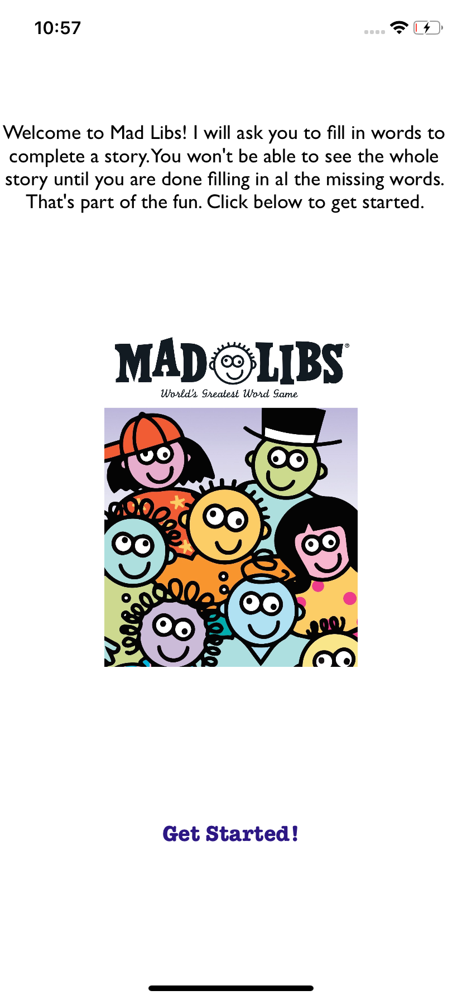
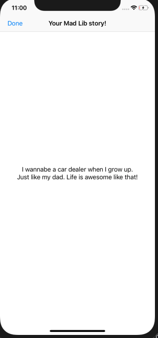

###  Mad Lib 

De app heeft 4 view controllers. Een introductiepagina, een pagina waar je je verhaal kiest, een pagina om de ontbrekende woorden in te vullen en de pagina met het eindverhaal. Je kan kiezen uit 5 verhalen en vult vervolgens de missende woorden in. Je maakt zo een persoonlijk verhaal met door jou gekozen woorden. 

